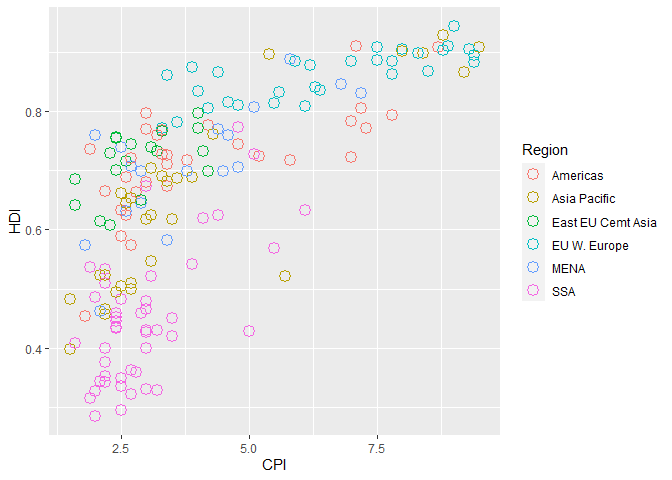
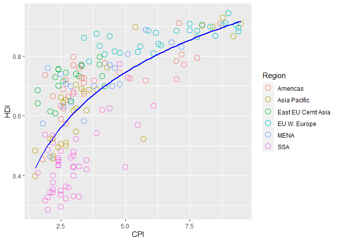
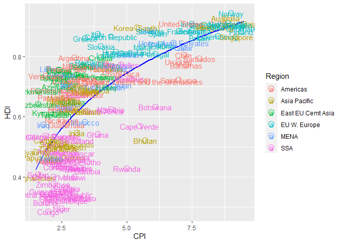
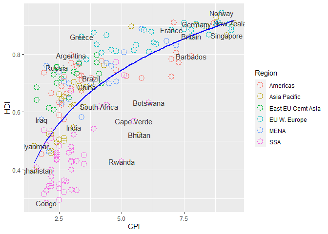
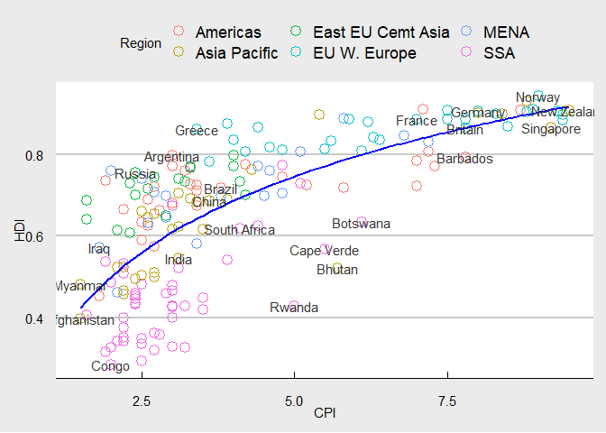
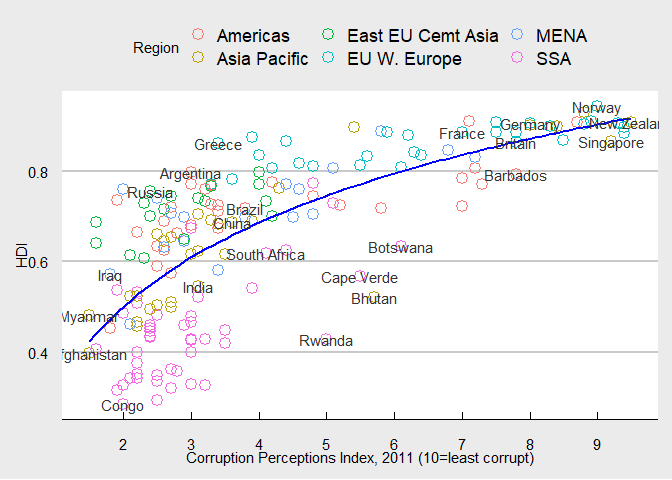
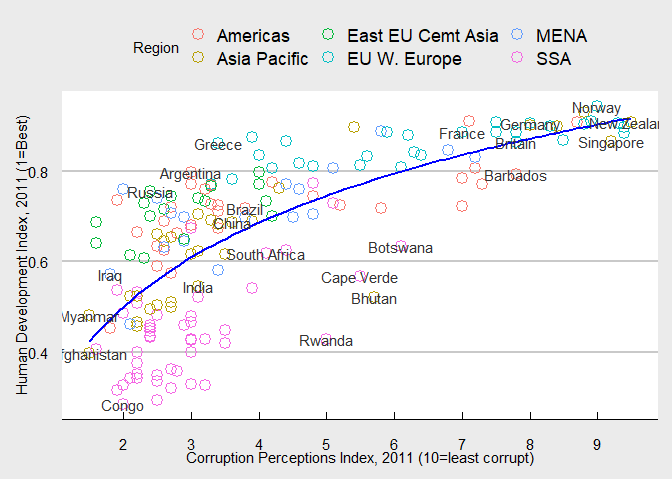
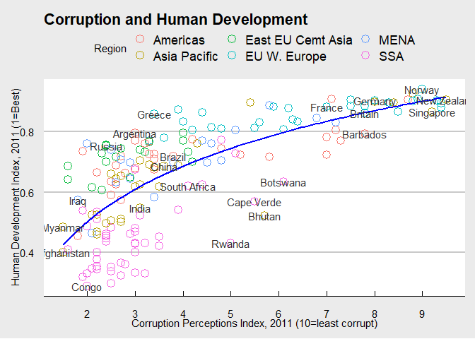

Scatterpolot_Graph_R
================
Dylan CASSIDY
2022-03-16

# Call libraries ggplot & data.table

# Use fread to Import Data from Excel Sheet

# Drop first column

``` r
library(ggplot2)
```

    ## Warning: package 'ggplot2' was built under R version 4.1.3

``` r
library(data.table)
```

    ## Warning: package 'data.table' was built under R version 4.1.3

``` r
dt <- fread("~/Github Projects/Scatterplot R/Economist_Corruption_Data.csv", drop=1)

head(dt)
```

    ##        Country HDI.Rank   HDI CPI            Region
    ## 1: Afghanistan      172 0.398 1.5      Asia Pacific
    ## 2:     Albania       70 0.739 3.1 East EU Cemt Asia
    ## 3:     Algeria       96 0.698 2.9              MENA
    ## 4:      Angola      148 0.486 2.0               SSA
    ## 5:   Argentina       45 0.797 3.0          Americas
    ## 6:     Armenia       86 0.716 2.6 East EU Cemt Asia

\#Set up scatterplot using X-axis for CPI and y-axis for HDI \#Color set
by region

``` r
pl <- ggplot(dt, aes(x=CPI,y=HDI,color=Region)) + geom_point(shape=19, size=3)

pl
```

<!-- -->

# Change shape of scatterplot to large empty circles

``` r
pl2 <- ggplot(dt, aes(x=CPI,y=HDI,color=Region)) + geom_point(shape=1, size=4)

pl2
```

<!-- -->

# Add simple red trend line using geom_smooth.

``` r
pl3 <- pl2 + geom_smooth(method="lm",formula=y~log(x),se=FALSE,color='blue')

pl3
```

<!-- -->

# Add labels to the scatterplot, using country name as label

``` r
pl4 <- pl3 + geom_text(aes(label=Country))

pl4
```

<!-- -->

# Limit labels to specific countries of interest

# Assign desired countries to ‘pointsToLabel’, then use geom_text to put these on the scatterplot

``` r
pointsToLabel <- c("Russia", "Venezuela", "Iraq", "Myanmar", "Sudan",
                   "Afghanistan", "Congo", "Greece", "Argentina", "Brazil",
                   "India", "Italy", "China", "South Africa", "Spane",
                   "Botswana", "Cape Verde", "Bhutan", "Rwanda", "France",
                   "United States", "Germany", "Britain", "Barbados", "Norway", "Japan",
                   "New Zealand", "Singapore")


pl4 <- pl3 + geom_text(aes(label = Country), color = "gray20", 
                data = subset(dt, Country %in% pointsToLabel),check_overlap = TRUE)

pl4
```

<!-- -->

# Add bw theme so that background is clear

``` r
library(ggthemes)
```

    ## Warning: package 'ggthemes' was built under R version 4.1.3

``` r
pl5 <- pl4 + theme_economist_white()

pl5
```

<!-- -->

# Set x-axis details

``` r
pl6 <- pl5 + scale_x_continuous(name='Corruption Perceptions Index, 2011 (10=least corrupt)', breaks=1:10)

pl6
```

<!-- -->

# Set y-axis details

``` r
pl7 <- pl6 + scale_y_continuous(name='Human Development Index, 2011 (1=Best)', waiver())

pl7
```

<!-- -->

# Set title

# View finished plot

``` r
pl8 <- pl7 + ggtitle('Corruption and Human Development')

pl8
```

<!-- -->
